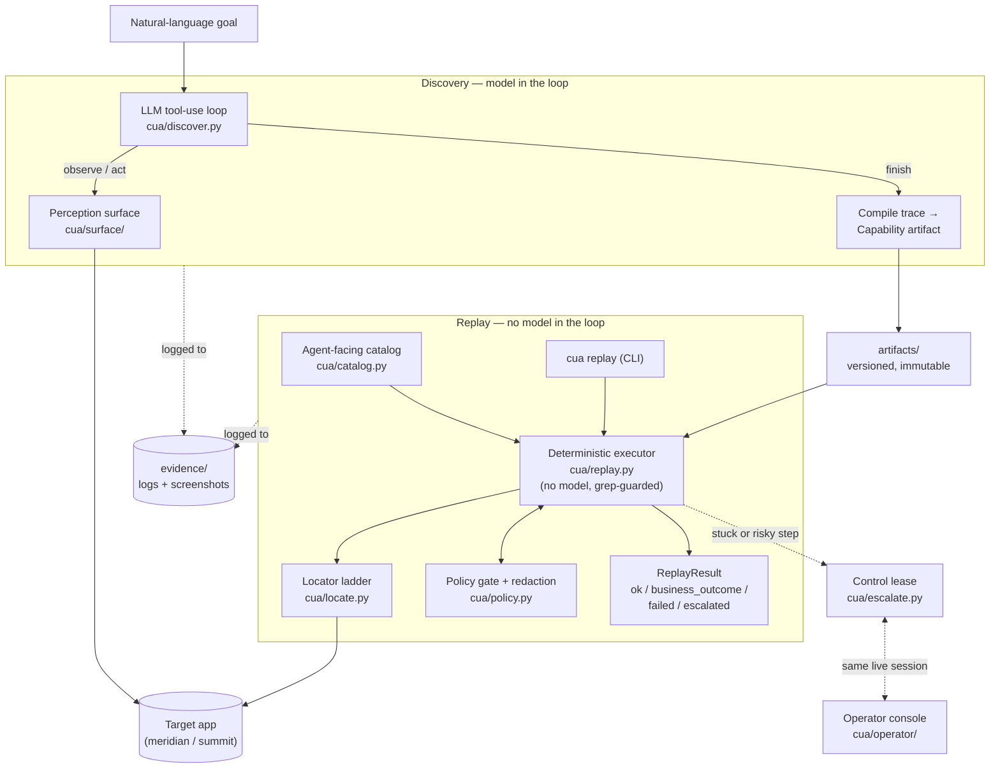

## Adapted to Meridian Core (this submission)

This repo now also targets **Meridian Core**
(`https://web-sample.interface-hiring.com`), a live, server-rendered
credit-union servicing console — a second, unrelated target from the one
the rest of this README describes, chosen to test the core against a real
system with no test IDs and no accessible-name bindings on its form
fields. Five capabilities are recorded and approved against it:

| Capability | Version |
|---|---|
| `mc_lookup_balance` | v1.0 |
| `mc_transfer` | v2.1 |
| `mc_open_share` | v1.0 |
| `mc_update_member` | v1.0 |
| `mc_place_hold` | v2.0 |

**Read [ADAPTATION.md](ADAPTATION.md) for the write-up** — what changed in
the core and why, what was found on the live target, what's still broken.
**[ADAPTATION_LOG.md](ADAPTATION_LOG.md)** is the unedited, running record
of every core-module change made to reach this target.

### Run it

```bash
# Capability API + agent-facing catalog (Flask, cua/catalog.py)
.venv/bin/python -m cua catalog list --tool-only

# Dashboard — run history, capability catalog, per-run detail
.venv/bin/python dashboard.py            # http://127.0.0.1:5051/

# Chatbot — conversational driver over the same capability API
.venv/bin/python chatbot.py              # http://127.0.0.1:5050/
                                          # operator console (escalations): http://127.0.0.1:8765/
```

Demo operators: `teller1` / `password` (regular teller), `super1` /
`password` (supervisor — required for `mc_place_hold` to succeed instead
of returning a permission-denied outcome). Demo members: `100234`,
`100987`.

**Demo path**: open the chatbot and ask it to look up member `100234`'s
balance. Then ask for a transfer between two open shares on member
`100987` (e.g. `100987-S0001-4` to `100987-MMKT-5`) — it will run up to
the policy gate and escalate; approve it from the operator console tab to
watch it complete with a confirmation number. Then open the dashboard to
see that run's step timeline, locator drift, and evidence.

One honest note: this is a shared, live target, and share balances and
HOLD/OPEN statuses shift over the course of a session — as of this
writing, member `100234` has exactly one OPEN share (`100234-S0070`;
every other share on that member is on HOLD), and member `100987` has
several OPEN shares including `100987-S0001-4` and `100987-MMKT-5`. Check
a member's current share statuses before demoing a transfer between two
open shares.

Everything below this section describes the **original** local target app
and its demo flow — unchanged, and it still works exactly as written.

---

# Computer-use automation for legacy enterprise apps

Some software has no API. Core banking screens, servicing tools, admin consoles —
if you want to automate them, the only way in is to drive the UI the way a human
operator would.

This system does that in two phases. First an LLM works out how to accomplish a
goal by actually clicking through a real application. Then that successful run
gets compiled into a typed, versioned **capability artifact** — and from then on
it replays deterministically, with no model in the loop at all.

The model discovers. The artifact is the capability. Deterministic replay is the
production path.

Along the way: a policy gate on every action, a human who can take over the same
live browser session when things go wrong, and committed evidence for every flow
so you can check that all of this really happened.

---

## Architecture at a glance



Two disjoint code paths share one perception surface and one target app.
**Discovery** puts an LLM in the loop to find a flow and compile it into an
artifact. **Replay** is a pure interpreter over that artifact — structurally
unable to import an LLM SDK — that a CLI or an agent's catalog call can trigger
in production. Both paths go through the same policy gate and write to the same
evidence store; when replay gets stuck, it can hand the same live browser
session to a human via the control lease rather than failing outright.

---

## Quick start

You'll need Python 3.11+ and Chromium for Playwright.

```bash
python3.11 -m venv .venv
.venv/bin/pip install -e .
.venv/bin/python -m playwright install chromium
cp .env.example .env
```

Then open `.env` and add **one** API key:

```
ANTHROPIC_API_KEY=sk-ant-...
# or
OPENAI_API_KEY=sk-...
```

The provider is auto-detected from whichever key is present.

Start the fake bank app, which serves on port 8080:

```bash
.venv/bin/python -m target_app.app                 # meridian tenant (default)
TENANT=summit .venv/bin/python -m target_app.app    # summit tenant (routes under /servicing)
```

Only one tenant can hold port 8080 at a time, so restart the process to switch
between them.

Sign in with `demo` / `demo123` if you want to click around it yourself first —
it's worth two minutes to see what the automation is up against.

Run the tests:

```bash
.venv/bin/python -m pytest tests/    # 147 passed
```

---

## The demo path

Everything below has been run. The evidence each command produced is committed
and indexed in [`evidence/EVIDENCE.md`](evidence/EVIDENCE.md).

### 1. Discovery — the LLM figures out the flow

Give it a goal in plain English and a starting point. It observes the page,
decides what to do, acts, and repeats until it's done.

```bash
.venv/bin/python -m cua discover \
  --provider openai \
  --goal "Log in to the servicing console at http://localhost:8080/login as demo/demo123 and open a new checking sub-account for member 10001 with a \$25.00 opening deposit. The Submit button is gated by policy — do not attempt to submit; treat the completed form as success and call finish." \
  --base-url http://localhost:8080 --tenant meridian \
  --app-id meridian_servicing_console --target-version 2024.03 \
  --capability-id open_subaccount \
  --param member_id=10001 --param operator_password=demo123 \
  --secret-param operator_password
```

Note what the goal *doesn't* say: it never mentions the search box, the View
link, or the sub-account button. The model finds those itself.

This writes `artifacts/open_subaccount/v1.0.json` — born as a `draft` — plus a
full transcript and per-step screenshots under `evidence/discovery_<id>/`.

Swap `--provider anthropic` to run the same thing against Claude.

### 2. Replay — the same flow, no model involved

This is the production path. It reads the artifact and executes it. Five
scenarios, each proving something different.

**It works.** Member 10001, balance extracted and returned:

```bash
.venv/bin/python -m cua replay --capability-id lookup_member_balance \
  --param member_id=10001 --param operator_password=demo123
```

**A business outcome, not a crash.** Member 99999 doesn't exist. That's a
legitimate answer the caller needs — so it exits 0 with a structured outcome,
not a stack trace:

```bash
.venv/bin/python -m cua replay --capability-id lookup_member_balance \
  --param member_id=99999 --param operator_password=demo123
```

**A hard failure, reported usefully.** Inject a server error and see which step
broke, what was expected, and what was actually observed:

```bash
.venv/bin/python -m cua replay --capability-id lookup_member_balance \
  --param member_id=10001 --param operator_password=demo123 \
  --inject-mode 500 --inject-after-step 3
```

**Recovery from an interstitial.** An unexpected dialog appears mid-flow. The
`dismiss_dialog` rule fires once, and the run completes:

```bash
.venv/bin/python -m cua replay --capability-id lookup_member_balance \
  --param member_id=10001 --param operator_password=demo123 \
  --inject-mode dialog --inject-after-step 3
```

**The same artifact, a different tenant.** Summit runs the same vendor product
with different routes and button labels. No re-recording — just an overlay.
Restart the target app with `TENANT=summit` first:

```bash
TENANT=summit .venv/bin/python -m target_app.app &

.venv/bin/python -m cua replay --capability-id lookup_member_balance \
  --overlay artifacts/lookup_member_balance/overlays/summit.v2.json \
  --param member_id=10001 --param operator_password=demo123
```

**Exit codes.** `0` for both `ok` and `business_outcome` — from the engine's
point of view both are successful replays. `2` for `failed`. `3` for
`escalated`. The full status is always printed as JSON on stdout, so callers can
branch on it without parsing stderr.

### 3. Escalation — a human takes over mid-run

When replay hits something it can't handle safely, it parks and hands control to
a person. Crucially, the human drives the *same* browser session — same cookies,
same half-filled form — not a fresh one.

```bash
.venv/bin/python scripts/live_escalation_demo.py
```

This runs the whole cycle end to end without needing you to click anything. It
spawns a real browser and the operator console on `http://127.0.0.1:8765`, waits
for the intervention to open, takes control, then hands back using the engine's
resume token. The resulting `manifest.json` stitches the replay evidence to the
console timeline so you can follow the handoff.

To run the console on its own:

```bash
.venv/bin/python -m cua operator --host 127.0.0.1 --port 8765
```

`/take_control` returns 409 until an intervention actually opens.

### 4. The catalog — an AI agent calls a capability by name

This is where the artifact stops being a file and starts being a contract.

```bash
# Every approved capability, as a tool definition an agent can consume:
.venv/bin/python -m cua catalog list --tool-only

# Invoke one directly — args are validated against ParamSpec first:
.venv/bin/python -m cua catalog invoke --name lookup_member_balance \
  --param member_id=10001 --param operator_password=demo123

# Or watch an LLM do it cold: read the catalog, pick a tool, call it, summarise.
.venv/bin/python demo_agent_invocation.py
```

The demo picks up whichever provider your `.env` has; override with
`DEMO_PROVIDER=anthropic|openai`.

---

## How it's laid out

```
target_app/    The fake servicing console. Deliberately legacy — nested tables,
               ASP.NET-style ids, no data-testid — but real <label for> and real
               button text, because that's how enterprise apps actually are.
               Two tenants: meridian (no prefix) and summit (/servicing).

cua/
  schema.py    The capability artifact. Pydantic v2, three version axes:
               schema_version, capability major.minor, and target_version.
  registry.py  Immutable version files, tenant overlays, approved-only loading.
  surface/     The perception seam. base.py is a Protocol, web.py drives
               Playwright, observation.py normalises the accessibility tree.
  locate.py    The locator ladder: role_name → label → text → table_cell → css
               → coordinates. Replay records which rung actually matched.
  policy.py    The gate, plus redaction. Enforced at the action layer.
  discover.py  The LLM tool-use loop.
  replay.py    The deterministic executor.
  escalate.py  The control lease state machine.
  operator/    The operator console (polling, not push).
  catalog.py   The agent-facing surface.
  llm.py       Provider-portable client; both SDKs imported lazily.
  result.py    The result contract and per-step rung telemetry.
  evidence.py  Structured logging, screenshots, redaction.

artifacts/     The capability registry.
evidence/      Committed proof that all of the above ran.
tests/         147 tests.
```

---

## Three things the code enforces structurally

**Replay cannot import an LLM SDK.** Not by convention — a grep-guarded test in
`tests/test_surface_and_ladder.py` fails loudly if either import string ever
appears in `cua/replay.py`. Replay is a pure interpreter over the artifact.

**Drafts are invisible to callers.** The catalog only ever surfaces capabilities
with an `approved` version on disk. A freshly discovered artifact can't be
invoked by an agent until someone signs off on it.

**Secrets never reach the tool schema.** Any ParamSpec marked
`sensitivity=secret` has its `example` stripped before publication, and runtime
values are redacted before anything is written to disk.

---

## One compatibility note

Playwright removed `Page.accessibility` in 1.60, and the discovery loop depends
on `page.accessibility.snapshot()`. Rather than pin the whole repo to an old
Playwright, there are two small pieces that paper over it:

- `cua/surface/observation.py :: capture_a11y_snapshot` walks the DOM and builds
  a Playwright-shaped nested dict using only `page.evaluate`, which 1.62 still
  supports.
- `cua/surface/_playwright_compat.py` installs a compat property on `Page` that
  delegates to it, imported for its side effect from `cua/__init__.py` and
  `cua/__main__.py`.

Everything downstream — the locator ladder, the action layer, replay — has no
idea any of this happened.

---

For the design reasoning behind all of it, see [REPORT.md](REPORT.md).
