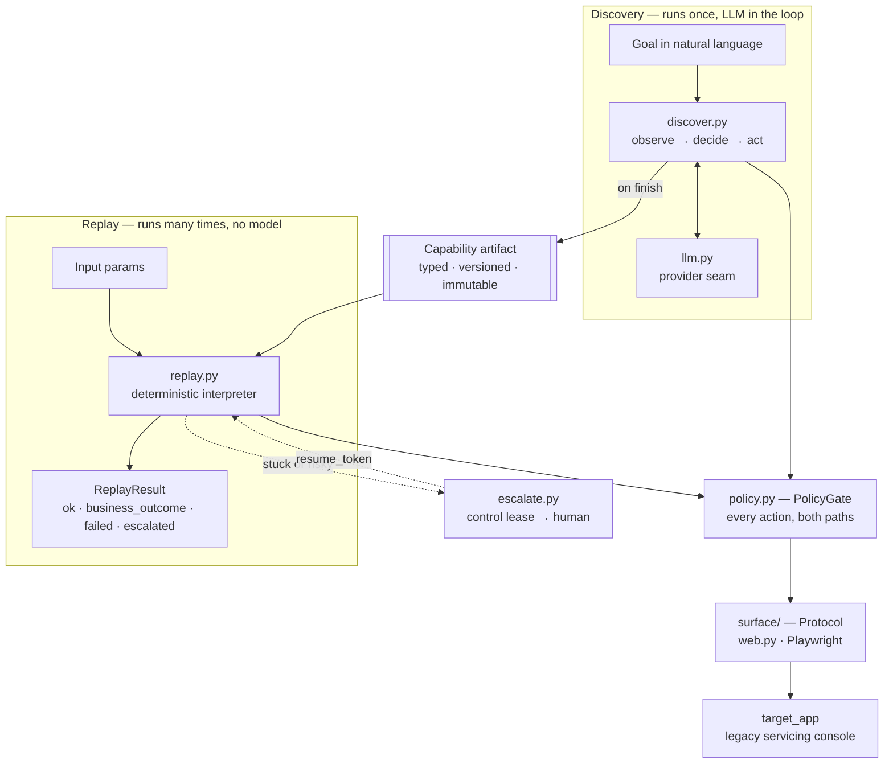
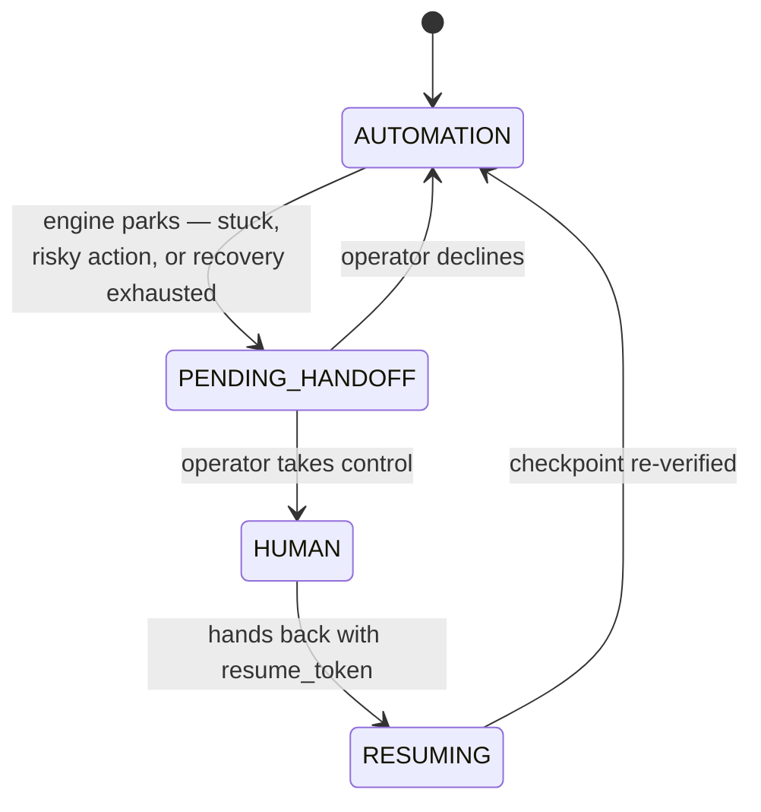

# REPORT

Design notes for the computer-use automation system. `README.md` has the setup
and every command line; `evidence/EVIDENCE.md` indexes the eight committed
live-recorded runs that back up the claims here.

## Architecture

The system has two code paths that never meet, sitting under one shared
perception surface.

The two things to read off that: the artifact is the only channel between the
two paths, and the policy gate is the single door both of them go through.

**Discovery** (`cua/discover.py`) puts an LLM in a tool-use loop against the
live app. Each turn: observe the page, the model proposes one typed action from
a fixed toolset (`navigate`, `click`, `type_text`, `select_option`, `read_text`,
`wait_for`, `finish`), the policy gate evaluates it, Playwright executes it,
observe again. Only `finish` compiles the trace into a `Capability` artifact.

**Replay** (`cua/replay.py`) is a deterministic interpreter over that artifact.
It structurally cannot import the Anthropic or OpenAI SDK — a grep-guarded test
in `tests/test_surface_and_ladder.py` fails loudly if either import string ever
appears. There is no model anywhere in the production decision loop, and that's
enforced by CI rather than by discipline.

Underneath both sits the **perception surface** (`cua/surface/`): `base.py` is a
`Protocol`, `web.py` is the Playwright implementation, `observation.py`
normalises the accessibility tree. A desktop surface would be another
implementation of the same Protocol. Only the web one ships.

Two things I decided early and would defend at length.

**The model reads the accessibility tree, not screenshots.** Screenshots are
captured as evidence, but they are never sent to the model. The a11y tree is the
representation that also exists on desktop applications, so building on it keeps
the desktop story credible rather than aspirational — and it keeps targeting
semantic rather than positional, which matters because pixel coordinates don't
survive a replay next month. The limit is real: against a surface with a broken
or absent a11y tree, vision would be the fallback, and `Observation` already
carries the bytes to make that possible.

**I didn't use an off-the-shelf agent framework.** Tools like OpenClaw,
browser-use, and similar scaffolds solve the discovery half well. But they have
no artifact and no deterministic replay model — their design goal is open-ended
autonomy, which is close to the opposite of what a bank back-office execution
path needs. Adopting one would also have meant inheriting a locator strategy and
an action vocabulary I couldn't defend, and those are precisely the parts under
evaluation. The rule I applied throughout: borrow mechanism, own design.
Playwright, Pydantic, and the model SDKs are all mechanism. The ladder, the
error taxonomy, and the control-transfer model are mine.

**I built the target application rather than using a public demo site.**
Saucedemo and similar sandboxes have clean DOMs, and more importantly they're
someone else's server — you cannot demonstrate session-timeout recovery,
permission denial, or an injected 500 on infrastructure you don't control.
Building it meant every runtime condition in the brief became reproducible on
demand, which is what makes the error-taxonomy evidence possible at all.

The app is hostile in the ways real enterprise software is hostile — nested
table layouts, ASP.NET-style generated ids, no `data-testid` — and deliberately
not hostile in ways it isn't. Form controls have real `<label for>` bindings and
buttons have real text, because legacy enterprise apps do have those; what they
lack is test IDs. Making it hostile *accurately* is what makes the
accessibility-first locator strategy an honest answer rather than a lucky one.
It would have been easy to strip labels too and force a coordinate-based
approach to look necessary.

Three of the conditions the error taxonomy handles occur naturally with no
injection at all: member `99999` doesn't exist, member `10002` is Restricted,
and an opening deposit under $25 fails validation. Evidence from a real
condition is stronger than evidence from a flag I set myself.

The rest of the modules are small and do one thing. `cua/locate.py` builds the
locator ladder. `cua/policy.py` is the single choke point in front of every
Playwright action; both loops call it. `cua/escalate.py` and `cua/operator/`
model control as a lease over one browser session. `cua/catalog.py` translates
approved capabilities into Anthropic- and OpenAI-shaped tool definitions and
executes them through the replay engine.

`cua/llm.py` is the provider seam. The brief was written around Anthropic; the
live runs here were recorded against OpenAI because that's the account I have
funded. Both providers are first-class, and every tool-translation test
exercises both shapes. One migration detail worth recording: `gpt-5` rejects the
legacy `max_tokens` parameter, so the OpenAI client sends
`max_completion_tokens`, and adds `response_format={"type":"json_object"}` for
the contract-proposal call. `demo_agent_invocation.py` shares that same client
rather than constructing its own, so it runs under the default model with no
workaround.

The abstraction has a known edge, and it's worth naming rather than claiming it
has none. The current GPT-5.6 series rejects function tools on Chat Completions
when reasoning is enabled, and directs callers to the Responses API instead.
Supporting it would mean a second wire-shape adapter behind the same
`ProviderClient` interface — the interface holds, the transport doesn't. I
verified this with a probe script before migrating, and stayed on `gpt-5`, which
works on the existing adapter, rather than take an unreviewed API migration this
late in the build.

One more thing that isn't a design decision so much as a repair. Playwright
removed `Page.accessibility` in 1.60, and the discovery loop depends on it.
Rather than pin the whole repo to 1.59, the surface ships a DOM-walk
implementation (`observation.py::capture_a11y_snapshot`) that produces the same
snapshot-shaped nested dict using only `page.evaluate`, plus a compat property
installed on `Page` by `_playwright_compat.py`. Nothing downstream knows the
upstream API changed — which is what a good seam is supposed to buy you.

## Artifact schema

`cua/schema.py`, Pydantic v2, `extra="forbid"` on every model. That last part
matters: an artifact carrying a field the schema doesn't know about fails at
load time, not three steps into a replay.

The shorthand I kept coming back to while building this is *model proposes,
schema disposes*. The LLM's output — including its proposal for the capability's
own input and output contract at the end of a discovery run — is untrusted
input, and Pydantic is the trust boundary. A hallucinated output type doesn't
get written to disk and quietly break a caller three weeks later; it fails
validation immediately.

A `Capability` carries a target, typed params, typed outputs, declared outcomes,
ordered steps, and its version and approval state.

**Three version axes, deliberately not collapsed.** `schema_version` is the
format itself. `version_major.version_minor` is the behaviour of one capability.
`target.target_version` is the upstream app build the recording was taken
against. These move independently — a schema migration isn't a re-recording, and
a vendor upgrade isn't either. `classify_version_bump()` compares two revisions
and returns `none | patch | minor | major`; anything that changes the
caller-visible contract (param, output, or outcome names) forces a major. The
reason for major/minor rather than one integer is that the artifact serves two
audiences with different stability needs — a calling agent that depends on the
contract, and a replay engine that depends on the recording. One number can't
express both.

**Params** carry a type and a sensitivity level: `public`, `internal`, `pii`, or
`secret`. Sensitivity isn't decoration — `secret` params have their `example`
stripped before the tool schema is published, and their runtime values redacted
at every evidence-write boundary.

**Outputs** are `ValueRef`s: extraction directives, a locator plus an optional
normaliser, shape-validated at load. The artifact stores *how to extract*, never
a captured value. That's the answer to "never persist sensitive data" — there's
nothing to leak because nothing is stored.

**Outcomes** are the part I'd point to first. They're declared in the artifact by
the capability author, not hardcoded in the engine, and classified as
`business_outcome`, `recoverable`, or `hard_failure`. "No such member" is data
someone declared, not a special case someone remembered to write. Business
outcomes exit 0, because they're answers the caller needs rather than crashes.

**Steps** carry the locator ladder, an optional post-action checkpoint, and
optional recovery rules. Replay records the `matched_rung` against the
`recorded_rung`, so drift becomes telemetry (`RungReport.drifted`) rather than a
silent hazard.

Released version files are immutable. New behaviour means a new version file or
a new overlay version — never an edit in place. That keeps every historical
replay tied to the contract it was actually verified against, and makes rollback
a matter of pointing at an older file.

## Determinism & error handling

Determinism comes from the artifact, not from the engine being careful. Every
decision — which step runs, which rung to try, whether a checkpoint fired, which
outcome matched — is pre-baked. There are no unbounded sleeps; every wait is
anchored to an explicit checkpoint or a bounded timeout, and `checkpoint_status`
records `ok`, `recovered`, `failed`, or `skipped`.

The result contract has four variants: `ok` and `business_outcome` both exit 0,
`failed` exits 2, `escalated` exits 3. The full status is always printed as JSON
on stdout so a caller can branch on it without parsing stderr. Conflating an
expected business outcome with a crash is the most common way to get this
problem wrong, and the type system here makes it hard to do by accident.

When something does fail, `ReplayHardFailure` carries the step index, the
action, what was expected, what was observed, the outcome name, the error, and
the evidence directory. Enough to reproduce without reading the surrounding
logs.

Two recovery mechanisms, both bounded. If the recorded rung misses, replay walks
the remaining rungs in order; a match on a lower rung completes the step and
records `drifted=true`, so gradual tenant drift shows up as a trend rather than
a sudden outage. Separately, a step can carry recovery rules like
`dismiss_dialog`, which the engine attempts once before failing the checkpoint.
Once, not until it works — unbounded retry is a bug, not robustness. After a
human handback the engine re-verifies the checkpoint before proceeding, because
you can't assume the human left the session where the artifact expects it.

## Heterogeneity & multi-tenant

The target app runs as either Meridian (no route prefix) or Summit
(`/servicing`, different button labels and headings), selected by a `TENANT` env
var. They're a stand-in for two institutions running the same vendor product,
configured differently.

Both replay from **one artifact**. A `TenantOverlay` carries a base capability,
the base version it was validated against, a tenant id, and a list of JSON-path
patches. `compose(base, overlay)` applies them and re-validates through
Pydantic, so the composed result is a first-class `Capability` that downstream
code can't distinguish from a non-overlaid one. Hundreds of tenants becomes
hundreds of small overlay files against a handful of bases, rather than hundreds
of recordings.

Staleness fails at load, not at runtime: `compose` refuses an overlay pinned to
a major the base has since moved past. An overlay left behind by a base bump
can't quietly run against the wrong recording.

The proof is in the evidence — the Summit replay returns the same
`checking_balance=285043` and `member_status="Active"` as the Meridian baseline,
and `tests/test_registry.py::test_summit_overlay_patches_every_meridian_string`
asserts that every Meridian-specific runtime string in the composed capability
was actually replaced.

For heterogeneous *surfaces* rather than tenants, the seam is
`cua/surface/base.py`. Everything above it — schema, replay, policy, escalation
— talks only to the Protocol. A desktop implementation would swap Playwright for
a UI-automation library and return the same `Observation` shape.

## Escalation & handoff

Control is a lease over a single browser session, not a boolean flag.

Exactly one party holds the lease at any instant. Illegal transitions raise
`IllegalTransition`; a call from the wrong actor raises `HolderMismatch`. Every
transition is timestamped and attributed, so the run log answers "who was in
control, and when" without inference.

The important word is *same*. The engine and the operator drive the same
Playwright/CDP session — `connect_web_surface` attaches over `connect_over_cdp`
— so the human inherits the cookies, the session, and the half-filled form. A
fresh browser would satisfy the letter of "a human takes over" and none of its
point. Notably `escalate.py` never imports Playwright at all; the operator UI
reaches the live browser through a `HumanActionHandler` seam, which is why the
lease logic is testable in pure process.

Handback is gated by a `resume_token` the engine mints when it parks. The
operator has to present it, which makes a stale or careless `POST /resume`
harmless.

The whole cycle runs end to end in `scripts/live_escalation_demo.py`, which
spawns a real browser and the operator console, polls for the intervention,
takes control, and hands back with the correct token. Evidence is committed for
both halves.

What's real here: the lease, the control transfer, the intervention routing, the
token gating, and the shared session. What's mocked: the operator's input
surface is a polling Flask page rather than a co-browsing console. That was the
explicitly permitted cut, and the mechanism underneath it is not mocked.

## Safety

Three mechanisms, all verifiable from the committed evidence.

**The policy gate sits at the action boundary.** `PolicyGate.evaluate(action)`
is called by both discovery and replay before Playwright touches the page.
`policy.yaml` declares an allowlist of domains and routes plus
`require_confirmation_patterns` for destructive verbs like `submit`, `delete`,
and `transfer`. Anything outside the allowlist, or a destructive verb without an
approved confirmation, doesn't execute. The evidence shows this working rather
than merely configured: the discovery run ends with the sub-account form filled
and `Submit` never attempted. The goal told the model to treat the completed
form as success precisely because the gate would have refused the submit anyway.

Enforcing at the action layer rather than in the prompt is the whole point. A
prompt is a suggestion; a gate is a control.

**Redaction happens at the write boundary.** Every write through
`cua/evidence.py` redacts by declared ParamSpec sensitivity first — `pii` and
`secret` values become shape-only tokens like `<redacted:string:5>` — then
applies a regex fallback from `policy.yaml::redaction_rules` to free-text
message and error fields. Separately, `cua/catalog.py` strips `example` from any
`secret` ParamSpec before publishing a tool schema, so a demo password never
reaches an agent reading the catalog.

**And one that was wired wrong until I ran it.** `demo_agent_invocation.py`
keeps its own transcript rather than going through `cua/evidence.py`. It had
defined `_redact_arguments_string` and `_redact_anthropic_content`, both
unit-tested, to scrub raw tool-call arguments before writing — and never called
either. The tests passed. The committed transcript held `demo123` in plaintext.
I only caught it by actually running the demo on the current default model and
grepping the output. Both helpers are now wired into `_shared_loop` and a rerun
confirms zero occurrences; the leaking evidence directory was deleted rather
than left in place, and `EVIDENCE.md` records the chain.

The lesson is worth stating because it generalises: unit-testing a redaction
helper proves the helper works, not that anything calls it. The only test that
would have caught this is a grep over the artifacts a run actually produces.

**On stray `demo123` occurrences.** Grepping the whole `evidence/` tree returns
hits only inside the discovery transcript and evidence log. Those are expected —
the login page publicly renders the demo credentials as help text, so they
appear in every a11y snapshot after `/login`. The value is declared `secret` and
is redacted in every downstream artifact.

**The limits, stated plainly.** The gate constrains action types and
destinations, not semantic intent — it cannot tell a correct transfer from an
incorrect one, only that a transfer was attempted. Redaction is
declaration-plus-regex, so a sensitive value in an undeclared field with a novel
shape would pass through. And the allowlist is only as good as the person
maintaining it.

## Cuts

Each of these was scoped out on purpose.

**No desktop surface, only a seam.** `base.py` is a `Protocol`; only `web.py` is
implemented. A desktop implementation would slot in against the same Protocol
without touching `replay.py` or `locate.py`.

**The operator console is a polling mock.** Plain HTTP endpoints and a polling
driver. No WebSockets, no auth, no multi-operator arbitration, no persistence.
Enough for an auditor to watch the full lease cycle; a production console would
swap in a push transport.

**No queueing or multi-tenant infrastructure.** One target-app process per
tenant, one browser per replay run, no job queue or rate limiter. The
multi-tenant *contract* is proven; the *infrastructure* deliberately isn't,
because the brief is explicit that abstractions which could scale are valuable
and prematurely built scaling infrastructure is not.

**No LLM fallback on replay failure — and this was the most tempting cut to
skip.** It's offered as a stretch goal. But when a step fails and no declared
recovery rule matches, the engine emits `ReplayHardFailure` and stops. It does
not quietly ask the model to invent a fix. Doing so would invalidate the single
guarantee the system exists to provide: deterministic, auditable replay. The
recovery story instead runs through drift telemetry — the ladder surfaces the
change, a maintainer re-discovers, and a new minor version is minted.

**No schema migration framework.** `schema_version` is a plain integer with no
auto-upgrade path. Bumping it means re-approving every capability by hand, which
is intentional — a silent migration would let a stale artifact quietly succeed
against a contract that moved underneath it.

**Tests are scoped, not exhaustive.** 147 unit tests cover the schema and
version-bump classification, the registry and overlay composition, the ladder's
drift telemetry and CSS-primary rejection, the error taxonomy and exit codes,
the policy gate, the catalog's tool translation and secret-stripping, the
escalation state machine and token gating, and the discovery loop's stuck guard.
End-to-end Playwright replays are proven by the committed evidence pack rather
than a CI job — the live suite is expensive and browser-flaky, and would gate
pull requests on unrelated Chromium updates.

**Two stretch goals I considered and skipped.** Code generation — emitting a
page object or test file from an artifact — is a clean idea but tangential to
every scored criterion, and the artifact is already the reusable output.
Multi-run stability scoring is a loop and a counter; I'd rather say that plainly
here than ship code whose only purpose is to be pointed at. The two I did build
were chosen because they close arguments the rest of the system opens:
cross-tenant reuse makes the multi-tenant claim demonstrable rather than
described, and the agent-facing catalog is the only thing that actually proves
the artifact is a callable contract rather than a well-shaped file.

**What I'd build next**, in order: a real push-transport operator console with
auth; a desktop surface implementation to prove the Protocol actually holds; and
a per-tenant health score driven by the rung-drift telemetry, which is the piece
that would turn drift detection from a signal into a workflow.
